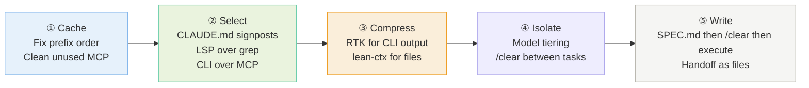
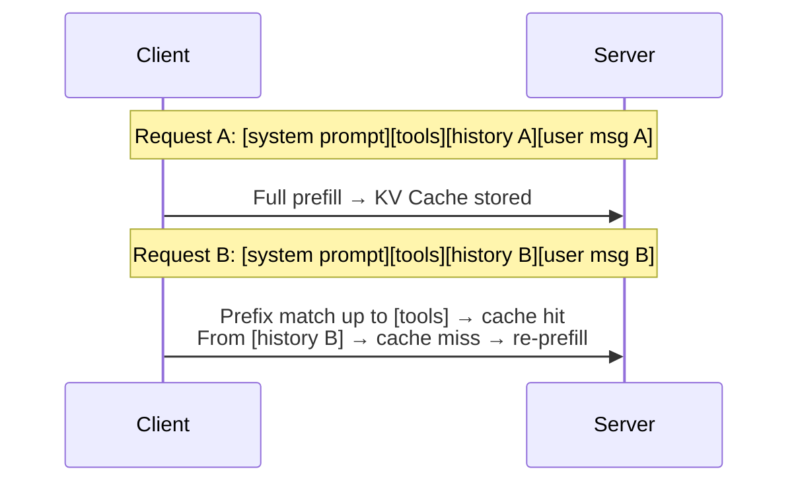
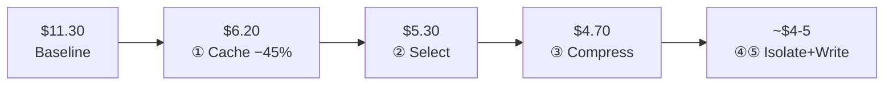

# Coding Agent Cost Optimization

## Core Principles

1. **Input tokens are 93-99% of cost** — every API call resends the full context
2. **Cached input is 10x cheaper** — Prompt Cache is the single biggest lever
3. **Context degrades at 80%** — don't wait for auto-compact at 95%
4. **Prevention beats reaction** — cache discipline + compression > /compact

## The Five Optimization Lines (by ROI)

### ① Cache — One-time setup, continuous savings (~45%)

Prompt Cache compares prefixes byte-by-byte from the start. Any difference = miss from that point forward.

**Cache killers:**
- **Random MCP tool registration order** → hardcode order in config
- **Unused MCP tools** → disable them (also saves tokens, reduces wrong-tool picks)
- **Timestamps / session IDs in system prompt** → move to message end
- **Attribution header on local models** → set `CLAUDE_CODE_ATTRIBUTION_HEADER: "0"` in settings.json (not shell export)
- **`--resume` timestamp drift** → use `claude-code-cache-fix`

### ② Select — Get the right code in context

**CLAUDE.md** — project map for the agent. ≤200 lines. Signposts, not encyclopedia:
- Entry points, business terminology, known pitfalls, directories to avoid
- Don't write what the agent already knows ("use TypeScript")

**LSP over grep** (static-typed projects: TS/Rust/Go/Java):
- `grep "calculateUsage"` → 200 results, mostly noise
- LSP find-references → 3 exact call sites
- Saves 5-34x tokens, proportional to project size
- Claude Code: `ENABLE_LSP_TOOL=1`; OpenCode: built-in

**CLI over MCP:**
- `gh` CLI = 1,365 tokens vs GitHub MCP = 44,026 tokens (32x)
- Priority: CLI > local API docs + curl > MCP
- GitHub / Jira / AWS / Supabase / Google Workspace all have CLIs

### ③ Compress — Prevent context bloat

**Prevention (doesn't break cache):**

| Tool | What | Rate | Install |
|---|---|---|---|
| RTK | CLI output | 80% session | `rtk init -g` |
| lean-ctx | CLI + file reads + MCP | 60-95% | `brew install lean-ctx` |

- Git/test output compresses best (90-92%) — most repetitive
- lean-ctx cached re-read returns ~13 tokens ("unchanged") instead of re-dumping

**Reaction (breaks cache — last resort):**
- `/compact` at 70-80%, don't wait for 95%
- DCP: surgical pruning of completed conversation segments

### ④ Isolate — Right model for right task

| Layer | Model | Tasks | Why |
|---|---|---|---|
| L1 | Haiku ($1/MTok) | File search, small edits, doc retrieval | Low error cost, deterministic |
| L2 | Sonnet ($3/MTok) | Tests, bug fixes, standard impl | Needs semantics, not architecture |
| L3 | Opus ($5/MTok) | Architecture, cross-module refactor | Rework cost >> model cost |

- 36% of calls run on Haiku, only 2.3% of total cost
- `/explore` uses Haiku automatically
- `/clear` between unrelated tasks — old history is noise, not signal

### ⑤ Write — External memory

- **SPEC.md**: discuss → write spec → /clear → execute from spec (50 rounds of history → 2k token file)
- **planning-with-files**: task_plan.md / findings.md / progress.md with hooks for auto read/write
- **/handoff**: compress session to 5-10%, fresh session reads the handoff doc
- **ctxlint**: CI check that CLAUDE.md paths still exist (`npx @yawlabs/ctxlint --strict`)

## Quick Cost Estimate

(Based on 1.62M input / 128K output / Opus 4.6 / 70% cache hit — estimates, not benchmarks)
