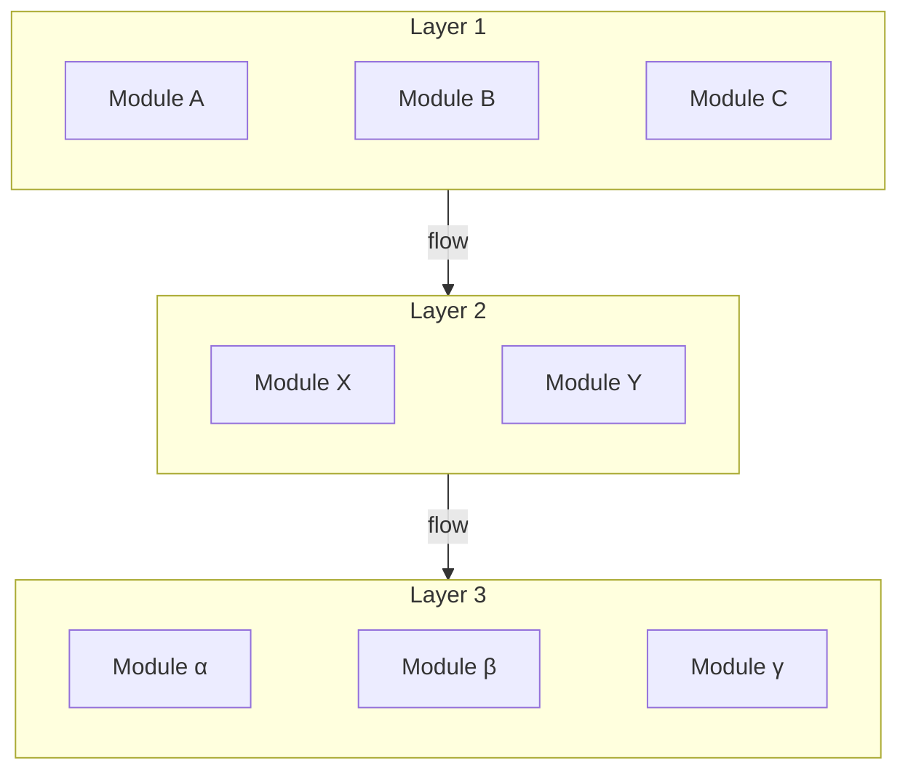
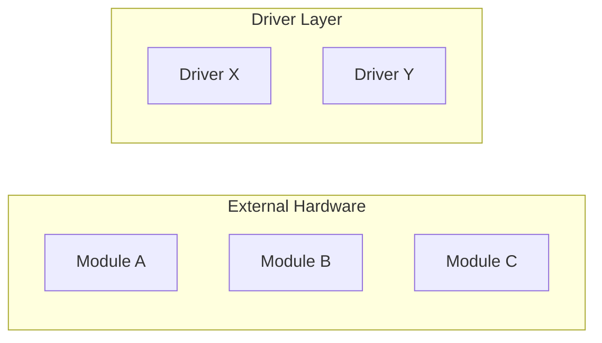

# Mermaid Multi-Layer Architecture Diagrams

> **Goal: clean layout, clear layers, no stray lines.** Use `---` as layout constraints, then hide them via styling — controls positioning without leaving unwanted edges.

---

## Core Technique: graph TB + Hidden Layout Edges

### When to Use

Multi-layer architecture diagrams (entry → business → data) where:
- Whole diagram flows **top-to-bottom** (layers stacked vertically)
- Modules within each layer are **side-by-side** (laid out horizontally)
- Arrows only between layers, no extra connections within a layer

### How It Works

1. Use `graph TB` to set overall top-to-bottom direction
2. Within each layer, chain modules with `---` — tells Mermaid these nodes belong on the same row
3. Use `linkStyle` to set those `---` edge widths to 0, hiding them
4. Draw arrows using subgraph IDs as source/target

### Template



### Key Points

- `---` is a **layout constraint**, not a business connection — it tells Mermaid "place these nodes on the same row"
- Count `---` edges: every pair of adjacent modules is one edge, numbered from 0
- `linkStyle 0,1,2,... stroke-width:0` hides only the layout edges; layer arrows remain visible
- Subgraph IDs (`Layer1` in `subgraph Layer1["Layer 1"]`) can be used as arrow sources and targets

---

## Alternative Layout: flowchart LR

### When to Use

Whole diagram flows **left-to-right** (e.g. hardware module architecture), and modules within each layer also run horizontally.

### How It Works

Use `flowchart LR` directly — modules listed one per line within each subgraph. No `---` needed:



In `flowchart LR` mode, subgraph nodes default to horizontal layout — no extra tricks required.

---

## Comparison

| Need | Solution | Needs `---`? | Needs `linkStyle`? |
|------|----------|-------------|-------------------|
| Vertical layers, horizontal modules inside | `graph TB` + `---` hidden edges | Yes | Yes |
| Horizontal overall, horizontal modules inside | `flowchart LR` | No | No |

**Why not use `flowchart LR` + subgraph `direction TB` for vertical layout?**
Mermaid 10.2.3 does not support `direction` overrides inside subgraphs, and this is the most broadly compatible version.

---

## linkStyle Edge Index Calculation

`linkStyle` indexes edges by their order of appearance in the code (starting from 0). The rule:

1. **All `---` edges are hidden** (layout-only, no arrows wanted)
2. **All `-->` edges are kept** (layer-to-layer arrows)

So list every `---` edge's index:

```
linkStyle 0,1,2,...,N stroke-width:0
```

Where N is the index of the last `---` edge. Simply count `---` occurrences.

### Multiple Subgraphs

Each `---` counts as one edge, even when chains span multiple lines:

```
subgraph Service["Business Layer"]
    A --- B --- C     ← 2 edges
    D --- E --- F     ← 2 edges
end
```

That's 4 `---` edges total, occupying 4 indices.

---

## Caveats

- Keep `---` chains short (≤5-6 modules per line), or Mermaid may wrap unexpectedly
- Split long layers into multiple `---` chains across separate lines
- Arrow labels should be brief — long text distorts layout
- Subgraph IDs must be unique, or arrow routing breaks
